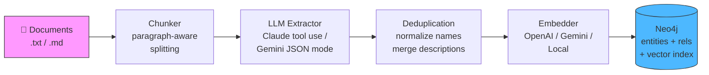
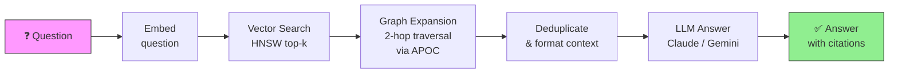
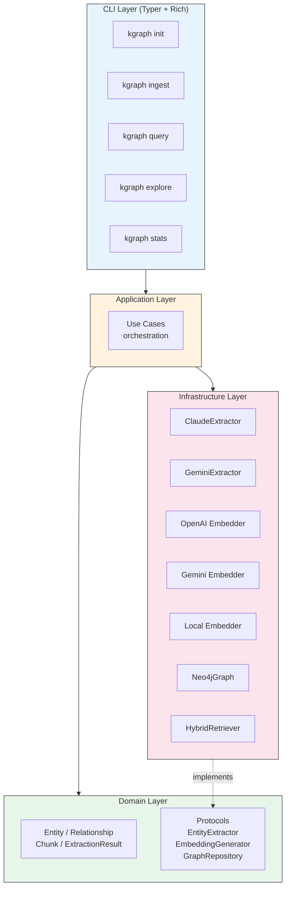

# kgraph

> CLI tool for building and querying knowledge graphs from documents.

## why this exists

there's no mature, CLI-first tool that does the full pipeline of "ingest any document → extract
entities/relationships via LLM → store in Neo4j → query via natural language" as a single
cohesive experience. kgraph fills that gap with a graphiti-like architecture (smart retrieval,
no LLM at query time for retrieval) and a graphrag-like CLI UX (`init/ingest/query` commands).

## key concepts

- **hybrid retrieval** — vector search + graph traversal, no LLM at retrieval time ([deep dive](docs/architecture/001-hybrid-retrieval-over-community-summarization.md))
- **structured extraction** — LLM tool use / JSON mode for guaranteed-schema entity/relationship extraction
- **graph expansion** — 2-hop neighborhood traversal to capture relational context
- **multi-provider** — supports both Anthropic Claude and Google Gemini for extraction + answer generation

## workflow

### ingestion pipeline



### query pipeline



### architecture



## getting started

### prerequisites

- **Python 3.10+**
- **Neo4j 5+** (with APOC plugin)
- **API key** — either a Gemini key (free tier available) or Anthropic key

### install

```bash
git clone https://github.com/pradyummenon/kgraph.git
cd kgraph

# create a virtual environment (recommended)
conda create -n kgraph python=3.12 -y && conda activate kgraph
# or: python -m venv .venv && source .venv/bin/activate

pip install -e ".[dev]"
```

### start neo4j

```bash
docker run -d --name kgraph-neo4j \
  -p 7474:7474 -p 7687:7687 \
  -e NEO4J_AUTH=neo4j/kgraph-password \
  -e NEO4J_PLUGINS='["apoc"]' \
  -v kgraph-data:/data \
  neo4j:5
```

### configure & run

```bash
# interactive setup — picks your LLM provider, embedding provider, and Neo4j connection
kgraph init

# ingest documents (.txt, .md)
kgraph ingest ./my-notes/

# ask questions
kgraph query "what is X related to?"

# explore an entity's neighborhood
kgraph explore "Entity Name"

# view graph statistics
kgraph stats
```

## LLM providers

kgraph supports multiple LLM and embedding providers. Choose during `kgraph init`:

| provider | extraction | embeddings | key required |
|----------|-----------|------------|-------------|
| **Gemini** (default) | gemini-2.0-flash | gemini-embedding-001 (768d) | Google AI API key |
| **Anthropic** | claude-sonnet-4 | — | Anthropic API key |
| **OpenAI** | — | text-embedding-3-small (1536d) | OpenAI API key |
| **Local** | — | BAAI/bge-base-en-v1.5 (768d) | none |

you can mix and match — e.g. Gemini for extraction + local for embeddings.

## project structure

```
kgraph/
├── pyproject.toml              # dependencies + build config
├── src/kgraph/
│   ├── cli.py                  # typer CLI commands (init, ingest, query, explore, stats)
│   ├── config.py               # config management (~/.kgraph/config.toml)
│   ├── domain/
│   │   ├── models.py           # entity, relationship, chunk domain models (frozen dataclasses)
│   │   └── services.py         # deduplication logic, protocols for dependency inversion
│   ├── infrastructure/
│   │   ├── chunker.py          # document reading + paragraph-aware text splitting
│   │   ├── extractor.py        # claude + gemini entity/relationship extraction
│   │   ├── embedder.py         # openai + gemini + local embedding generation
│   │   ├── graph.py            # neo4j driver (indexes, batch ingestion, search)
│   │   └── retriever.py        # hybrid retrieval (vector + graph expansion)
│   └── application/
│       └── use_cases.py        # CLI command orchestration
├── tests/
│   ├── conftest.py             # shared fixtures
│   └── unit/                   # chunker + domain model tests
├── docs/
│   └── architecture/           # ADRs
├── .env.example
├── Makefile
└── .github/
    └── pull_request_template.md
```

## design decisions

| decision | rationale |
|----------|-----------|
| **hybrid retrieval over graphrag** | skip community summarization — 100x cheaper, still captures relational context via 2-hop expansion |
| **protocols for DI** | swap extractors/embedders without touching business logic |
| **frozen dataclasses** | immutable domain models prevent accidental mutation |
| **async throughout** | neo4j, anthropic, openai, gemini SDKs are all async-native |
| **single config file** | `~/.kgraph/config.toml` — simple, no env vars required |

## tech stack

| technology | role |
|-----------|------|
| python 3.10+ | type hints, protocols, dataclasses |
| typer + rich | modern CLI with beautiful terminal output |
| anthropic (claude) | structured extraction via tool use + answer generation |
| google gemini | structured extraction via JSON mode + embeddings |
| neo4j | graph DB with HNSW vector index, full-text index, APOC |
| pydantic | strict data models, JSON schema generation for LLM tool use |
